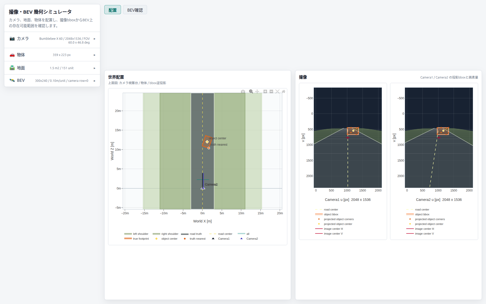
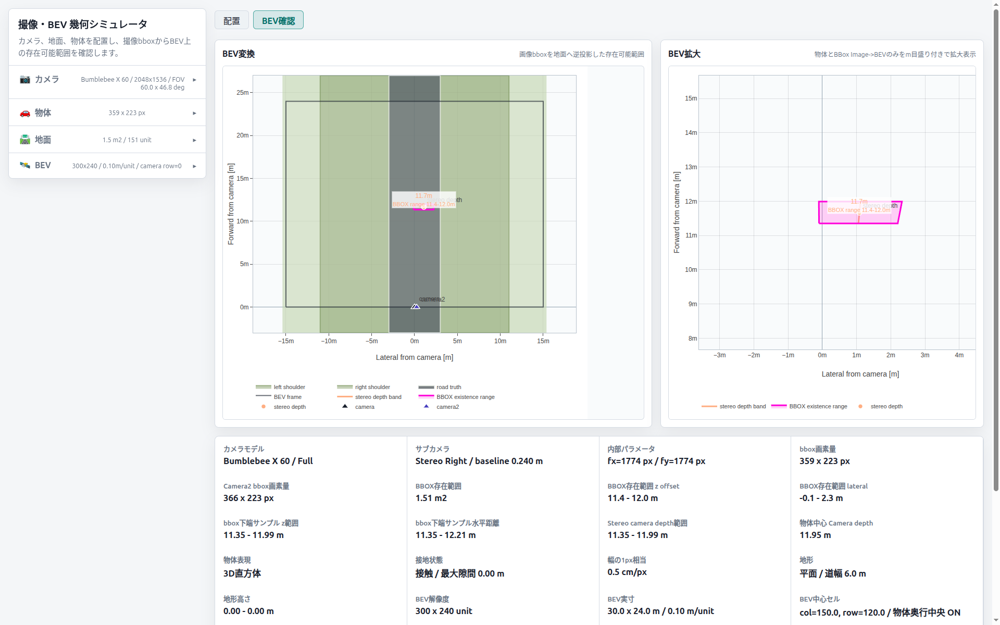

# BEV-Geometric-Simulator

撮像・BEV 幾何シミュレータ 
ステレオカメラの撮像 bbox から、BEV 上の存在範囲と depth 範囲を確認するためのローカル Web アプリです。

## 目的

このアプリは次を確認するためのものです。

- 世界に置いた物体が、左右カメラでどのような bbox になるか
- その bbox と stereo disparity から、どの程度の depth 範囲が出るか
- 解像度や bbox 誤差 `pixelTol` によって、BEV 上の存在範囲がどう変わるか

## 画面構成

### 配置


- `世界配置`
  - 真値の世界配置を上面図で表示
  - カメラ、サブカメラ、道路、地形、物体 footprint を表示
- `撮像`
  - `Camera1`
  - `Camera2`
  - 左右画像上の bbox と投影点を表示

### BEV確認


- `BEV変換`
  - 撮像 bbox から計算した `BBOX existence range`
  - `stereo depth`
  - `stereo depth band`
- `BEV拡大`
  - 上記の BEV 推定結果を拡大表示
- `metrics`
  - bbox 画素量、depth 範囲、BEV 範囲などを表示

## 定義

### 世界配置

- world 表示は真値用です
- 物体の `Z m` は物体中心位置です
- `truth nearest` は、物体 footprint のうちカメラに最も近い点です

### 撮像

- 撮像の `u, v` は pixel 単位です
- bbox と撮像由来の pixel 値は整数 px として扱います
- 表示も整数 px です

### BEV

- BEV は world 表示の使い回しではなく、撮像由来の推定表示です
- 軸は `Lateral from camera [m]` と `Forward from camera [m]` です
- `Depth` は camera 前方距離として扱います

### BBOX existence range

このアプリでの `BBOX existence range` は、

- 撮像 bbox
- stereo の中心 disparity
- `pixelTol`

から作る BEV 上の存在範囲です。

現在の計算は次の前提です。

1. 左右 bbox の中心から中心 disparity を作る
2. `center disparity ± pixelTol` から near / far depth を作る
3. 左 bbox の `left / right` を near / far depth に投影する
4. その 4 点で BEV 上の台形を作る

つまり、`BBOX existence range` は「撮像の解像度と disparity 誤差に依存した存在範囲」です。

## カメラモデル

選択可能:

- `Bumblebee X 60`
- `Bumblebee X 80`
- `Bumblebee X 105`

解像度:

- `Full`
- `Quarter`

サブカメラ:

- `Stereo Right`
- `Manual`

`Stereo Right` の場合、サブカメラは左カメラ基準の baseline 位置に置かれます。

## 主要パラメータ

### カメラ

- `X m`, `高さ m`, `Z m`
- `Yaw deg`
- `Pitch down deg`
- `サブカメラ`

### 物体

- `X m`, `Z m`
- `Yaw deg`
- `幅 m`, `高さ m`, `奥行 m`
- `接地高さ m`
- `表現`
  - `3D直方体`
  - `Point`

### 地面

- `地形タイプ`
  - `平面`
  - `上り坂道`
  - `下り坂道`
  - `両脇上り坂`
  - `両脇下り坂`
- `道幅 m`
- `脇坂幅 m`
- `基準Y m`
- `道路勾配 deg`
- `両脇勾配 deg`

### BEV

- `BEV幅 Unit`
- `BEV奥行 Unit`
- `1Unit長 m`
- `固定する値`
  - `1Unit長`
  - `解像度`
- `物体を奥行中央`
- `bbox誤差 px`

## 起動方法

このアプリは静的ファイルで動きます。

サーバ起動コマンド:

```bash
# このリポジトリ直下で実行
python3 -m http.server 18000 --bind 127.0.0.1
```

ブラウザで次を開きます。

```text
http://127.0.0.1:18000/
```

## 実装ファイル

- `index.html`
- `styles.css`
- `app.js`

## 注意

- Plotly は CDN 読み込みです
- ブラウザが外部 CDN に到達できないと描画できません
- 現在の BEV 推定は、物体認識器や stereo matcher を使った実画像処理ではなく、幾何モデルによるシミュレーションです
- `BBOX existence range` は、物体の真の 3D 占有体積そのものではなく、撮像 bbox と disparity 誤差から算出する推定範囲です
